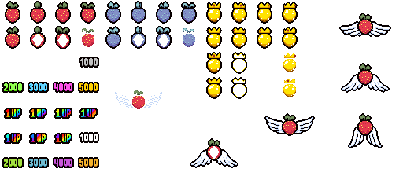

#  Strawberry - Impress your friends
TODO FIX ICONS
## Effect

While held, Isaac can collect strawberries that will follow him. \
Using the active will convert all pedestal items in the room into strawberries. \
These strawberries will not do anything until Isaac collects them and then stops moving, but whe he does, they will count up score. \
The more berries, the higher the score, the higher quality item from Chaos pool will spawn. \
Consuming 6+ berries will result in reaching a  state that grants the vanilla item   **1up!** and any additional berries will grant permanent  +1 luck while holding Strawberry item.

### Different types of strawberries that can spawn:

 Red - if any player holds Strawberry, 15% chance to spawn when entering a room for the first time; it just stays in place; disappears when Isaac leaves the room

 Blue - they can appear only if player uses the item's active and converts pedestals; they will not disappear when Isaac leaves the room

 Winged - has 40% chance to replace any Red berry that would spawn; runs away on room clear or disappears when Isaac leaves the room

 Golden - spawns upon entering new floor if Isaac holds Strawberry; gets destroyed when Isaac takes any type of damage

### Scores:
 (1 berry) = 

 (2 berries) = 

 (3 berries) = 

 (4 berries) = 

 (5 berries) = 

 (6+ berries) =  +  + 

## Item pools

- Treasure (0.4 weight)
- Greed Treasure (0.4 weight)
- Greed Shop (0.2 weight)
- Ultra secret (1 weight)

## Four Souls card

## Dev Comments
This item's effect was based on the game Celeste that lead developer really loves. \
All sound efect are imported from Celeste itself.